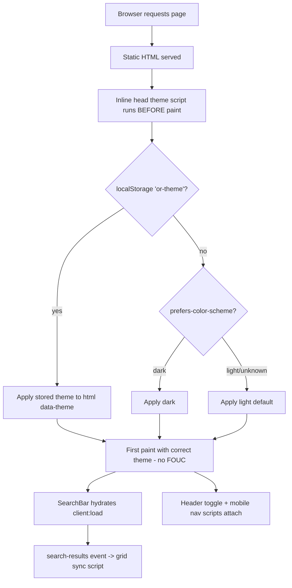

# Design Document

## Overview

This design specifies a complete visual overhaul of **OpenRadar**, an existing Astro 6 + React 19 + Tailwind CSS v4 static site that serves as a hand-curated index of trending open-source projects. The current look is editorial/print/terminal: warm paper, ink text, hairline frames, a single vermilion accent, and a Fraunces/Inter/JetBrains Mono type system.

The redesign introduces a **"Luminous Depth"** aesthetic: refined neutrals paired with a vivid accent, layered surfaces with soft elevation, gentle radii, and tasteful motion — delivered in both **light and dark** modes with a user-controllable, FOUC-free theme toggle. The whole system is **token-driven**, so the exact palette, type, and elevation can be tuned during review without restructuring components.

This is strictly a **presentation-layer** change. The following are treated as fixed contracts and are preserved exactly:

- **Content collection schema** in `src/content.config.ts` (no schema changes).
- **Routes**: `/` (Homepage), `/projects/{slug}`, `/tags`, `/tags/{tag}`.
- **`search-results` CustomEvent contract** between the React `SearchBar` island and the statically rendered grid in `index.astro` — `detail` carries `slugs`, `total`, `count`, `query`, `selectedTag`.
- **SEO emission** in `Layout.astro`: title, meta description, canonical URL, Open Graph, Twitter Card, and JSON-LD structured data.
- **Static build** through the existing Astro pipeline; **only** the `SearchBar` is hydrated (`client:load`).

### Goals

- A cohesive, modern, accessible (WCAG AA) visual system applied consistently across all pages and components.
- Light/dark theming applied before first paint, persisted across visits, honoring system preference.
- Preserve all existing behavior: search/tag filtering, listings, detail pages, SEO, and graceful degradation if the island fails to hydrate.

### Non-Goals

- Changing data sourcing, schema, routes, or the build pipeline.
- Adding server-side rendering or new runtime dependencies in the shipped bundle (test-only dev dependencies are in scope).
- Adding image assets for decorative effects — all gradients/shadows/blur are CSS-only.

## Architecture

### Rendering and hydration model

OpenRadar remains a fully static Astro site. Pages and components render to static HTML at build time. The only client-hydrated component is `SearchBar` (`client:load`). The redesign keeps this model:

- All visual styling is delivered via Tailwind v4 utilities + a token layer in `src/styles/global.css`. No styling requires JavaScript.
- Two small **vanilla** (non-React) scripts are added for interactivity that must work without the React runtime: the **theme controller** (inline, in `<head>`) and the **header UI** (theme toggle + mobile nav disclosure). Keeping these as vanilla scripts avoids adding hydration cost and keeps the React surface area unchanged.
- The existing inline grid-sync script in `index.astro` (which listens for `search-results`) is preserved.



### Token-driven theming with Tailwind v4

Tailwind v4 configures the design system in CSS (`@import "tailwindcss"` + `@theme`). For **runtime** theme switching we use Tailwind v4's `@theme inline` feature together with a raw CSS-variable layer:

- Raw, mode-specific values live on `:root` (light) and `:root[data-theme="dark"]` (dark).
- `@theme inline { --color-bg: var(--bg); ... }` makes the generated utilities (`bg-bg`, `text-text`, etc.) reference the variable **by reference** rather than baking the value at build time. Toggling `data-theme` on `<html>` therefore recolors the entire site instantly, with no rebuild and no per-utility duplication.
- A custom dark variant is registered for the rare cases that need explicit dark-only rules beyond a token swap:

```css
@custom-variant dark (&:where([data-theme="dark"], [data-theme="dark"] *));
```

```css
/* shape of the token layer in src/styles/global.css */
:root {
  --bg: #f6f7f9; /* light values */
  --text: #14171f;
  /* …all semantic raw tokens… */
  color-scheme: light;
}
:root[data-theme="dark"] {
  --bg: #0b0d12; /* dark overrides */
  --text: #f2f4f8;
  /* …dark raw tokens… */
  color-scheme: dark;
}
@theme inline {
  --color-bg: var(--bg);
  --color-text: var(--text);
  /* …expose every raw token as a Tailwind color/utility… */
}
```

This is the mechanism that satisfies "same tokens consistently across all pages" and "complete token set for both modes": every component consumes semantic utilities (e.g. `bg-surface`, `text-muted`, `border-line`, `text-accent`), never hard-coded hex.

### File-level change map

| File                               | Change                                                                                                                                                                                                                                                                       |
| ---------------------------------- | ---------------------------------------------------------------------------------------------------------------------------------------------------------------------------------------------------------------------------------------------------------------------------- |
| `src/styles/global.css`            | Replace editorial palette with the dual-mode token layer (`:root` + `[data-theme]` + `@theme inline`), new type/spacing/radius/elevation/motion tokens, dark variant, reusable primitives (`.surface`, `.btn`, `.pill`, `.chip`, animation keyframes, reduced-motion guard). |
| `src/layouts/Layout.astro`         | Add inline pre-paint theme script, `color-scheme`/`theme-color` meta, non-blocking font loading. Preserve all SEO emission unchanged.                                                                                                                                        |
| `src/components/Header.astro`      | Redesign; add theme toggle control + mobile nav disclosure (vanilla JS), active link via `aria-current`.                                                                                                                                                                     |
| `src/components/Footer.astro`      | Restyle to new tokens; keep identity, explore group, resources group, year.                                                                                                                                                                                                  |
| `src/components/ProjectCard.astro` | Restyle as elevated surface; preserve props, `formatNumber`, ≤4 tags, zero-padded index, `/projects/{slug}` link.                                                                                                                                                            |
| `src/components/TagBadge.astro`    | Restyle as soft pill on new tokens.                                                                                                                                                                                                                                          |
| `src/components/SearchBar.tsx`     | Restyle only; **filtering logic and `search-results` dispatch unchanged**. Extract pure helpers for testability.                                                                                                                                                             |
| `src/pages/index.astro`            | Restyle hero/stats/featured/index; preserve data computations, `#projects-grid`, `#projects-empty`, `.project-item[data-slug]`, and the grid-sync script.                                                                                                                    |
| `src/pages/projects/[slug].astro`  | Restyle; preserve `getStaticPaths`, breadcrumb, external link `rel`, prose, related.                                                                                                                                                                                         |
| `src/pages/tags/index.astro`       | Restyle; **add empty-state** for no tags.                                                                                                                                                                                                                                    |
| `src/pages/tags/[tag].astro`       | Restyle; preserve `getStaticPaths` and JSON-LD.                                                                                                                                                                                                                              |
| `package.json`                     | Add dev-only test tooling (Vitest + fast-check + Testing Library). No runtime deps added.                                                                                                                                                                                    |

## Design System

All values below are **proposed defaults** for the "Luminous Depth" direction and are intentionally token-driven so the palette can be retuned in review without touching components.

### Color tokens

Semantic names (consumed everywhere) mapped to raw values per mode. Contrast pairings are chosen to target WCAG AA (≥ 4.5:1 for body text, ≥ 3:1 for large text / meaningful UI); final values are verified during the a11y testing pass.

| Semantic token  | Role                  | Light                  | Dark                     |
| --------------- | --------------------- | ---------------------- | ------------------------ |
| `bg`            | App canvas            | `#f6f7f9`              | `#0b0d12`                |
| `surface`       | Raised card/panel     | `#ffffff`              | `#14171f`                |
| `surface-2`     | Sunken/secondary fill | `#eef0f4`              | `#1c2029`                |
| `line`          | Hairline border       | `#e3e6ec`              | `#262b36`                |
| `line-strong`   | Emphasized border     | `#cfd4de`              | `#384150`                |
| `text`          | Primary text          | `#14171f`              | `#f2f4f8`                |
| `text-2`        | Secondary text        | `#49505f`              | `#aab2c2`                |
| `muted`         | Tertiary / labels     | `#727a8b`              | `#7c8497`                |
| `accent`        | Primary accent        | `#5b50e6`              | `#8b80ff`                |
| `accent-strong` | Hover/pressed accent  | `#4a3fcf`              | `#a79dff`                |
| `accent-soft`   | Accent tint fill      | `rgba(91,80,230,0.12)` | `rgba(139,128,255,0.16)` |
| `on-accent`     | Text/icon on accent   | `#ffffff`              | `#0b0d12`                |
| `gold`          | Star metric           | `#c8890f`              | `#f0b429`                |
| `focus`         | Focus ring            | `#5b50e6`              | `#a79dff`                |

- **Primary accent** (`accent`) is used consistently for interactive and emphasis elements (links on hover, active nav, card hover title, focus rings, primary buttons, selected chips) across every page (Req 1.3).
- `on-accent` flips per mode so accent-filled controls keep AA-level label contrast in both themes.

### Typography scale

Keep the expressive display face (Fraunces) for headings, a clean sans (Inter) for body, and mono (JetBrains Mono) for labels/metadata. Fluid sizing via `clamp()` so type scales between mobile and desktop (Req 10.5).

| Token            | Use               | Value                                            |
| ---------------- | ----------------- | ------------------------------------------------ |
| `--font-display` | Headings          | `"Fraunces", Georgia, serif`                     |
| `--font-body`    | Body/UI           | `"Inter", system-ui, sans-serif`                 |
| `--font-mono`    | Labels/metadata   | `"JetBrains Mono", ui-monospace, monospace`      |
| `--fs-display`   | Hero H1           | `clamp(2.75rem, 7vw, 5.25rem)`                   |
| `--fs-h1`        | Page H1           | `clamp(2.5rem, 6vw, 4.5rem)`                     |
| `--fs-h2`        | Section           | `clamp(1.75rem, 3.5vw, 2.75rem)`                 |
| `--fs-h3`        | Card title        | `clamp(1.2rem, 2vw, 1.5rem)`                     |
| `--fs-lead`      | Lead paragraph    | `clamp(1.05rem, 1.4vw, 1.25rem)`                 |
| `--fs-base`      | Body              | `1rem`                                           |
| `--fs-sm`        | Small             | `0.875rem`                                       |
| `--fs-label`     | Mono kicker/label | `0.6875rem` (letter-spacing `0.16em`, uppercase) |

Display headings, body text, and metadata labels remain three visually distinct, token-driven styles (Req 1.4).

### Spacing, radius, elevation, motion

**Spacing** uses Tailwind's default scale plus a small set of rhythm tokens for vertical section spacing:

| Token             | Value                      | Use                             |
| ----------------- | -------------------------- | ------------------------------- |
| `--space-section` | `clamp(4rem, 8vw, 7rem)`   | gap between major page sections |
| `--space-block`   | `clamp(2.5rem, 5vw, 4rem)` | sub-section spacing             |
| `--container-max` | `1180px`                   | max content width (preserved)   |

**Radius** (introduces soft rounding to replace the flat 0-radius frames):

| Token           | Value     |
| --------------- | --------- |
| `--radius-sm`   | `0.5rem`  |
| `--radius-md`   | `0.75rem` |
| `--radius-lg`   | `1rem`    |
| `--radius-xl`   | `1.5rem`  |
| `--radius-full` | `9999px`  |

**Elevation / shadow** (soft, layered; dark mode uses deeper shadow + a 1px top inner highlight for the "luminous edge"; hover adds an accent glow):

| Token           | Light                                                           | Dark                                                              |
| --------------- | --------------------------------------------------------------- | ----------------------------------------------------------------- |
| `--shadow-sm`   | `0 1px 2px rgba(16,20,30,.06), 0 1px 3px rgba(16,20,30,.08)`    | `0 1px 2px rgba(0,0,0,.5)`                                        |
| `--shadow-md`   | `0 4px 12px rgba(16,20,30,.08), 0 2px 4px rgba(16,20,30,.06)`   | `0 6px 20px rgba(0,0,0,.55)`                                      |
| `--shadow-lg`   | `0 16px 40px rgba(16,20,30,.12)`                                | `0 20px 50px rgba(0,0,0,.6)`                                      |
| `--shadow-glow` | `0 0 0 1px var(--accent-soft), 0 10px 30px rgba(91,80,230,.18)` | `0 0 0 1px var(--accent-soft), 0 10px 30px rgba(139,128,255,.22)` |

**Motion** (entrance + interaction; all motion uses transform/opacity only, Req 9.5; entrance ≤ 600ms, Req 9.4):

| Token           | Value                                  |
| --------------- | -------------------------------------- |
| `--ease-out`    | `cubic-bezier(0.16, 1, 0.3, 1)`        |
| `--ease-in-out` | `cubic-bezier(0.65, 0, 0.35, 1)`       |
| `--dur-fast`    | `120ms`                                |
| `--dur-base`    | `200ms`                                |
| `--dur-slow`    | `360ms`                                |
| `--dur-enter`   | `500ms` (entrance; capped under 600ms) |

### Reusable primitives

To satisfy "single shared definition for any primitive used on more than one page" (Req 1.5), the following are defined once in `global.css` and reused:

- `.surface` — raised card/panel: `surface` bg, `line` border, `--radius-lg`, `--shadow-sm`; hover variant `.surface-interactive` lifts (`translateY(-2px)`) to `--shadow-md`/glow.
- `.btn` / `.btn-primary` / `.btn-ghost` — buttons and CTA links (44px min target).
- `.pill` — language/metadata pill.
- `.chip` — tag/filter chip with selected state (used by `TagBadge` and `SearchBar`).
- `.label` — mono uppercase kicker.
- `.ulink` — animated-underline inline link.
- `.prose` — markdown typography for project bodies.
- Entrance keyframes (`reveal-up`) + a `prefers-reduced-motion` guard.

## Components and Interfaces

### Theme Controller

Two cooperating pieces, both vanilla (no React):

1. **Pre-paint inline script** (in `Layout.astro` `<head>`, `is:inline`): runs synchronously before body render. Resolves the active theme and sets `document.documentElement.dataset.theme`.

   ```js
   // resolution precedence
   stored = localStorage["or-theme"]; // 'light' | 'dark' | null
   theme =
     stored ??
     (matchMedia("(prefers-color-scheme: dark)").matches ? "dark" : "light");
   document.documentElement.dataset.theme = theme;
   ```

   Wrapped in `try/catch` so a throwing/blocked `localStorage` falls back to system, then to `light` (Req 2.2, 2.3, 2.6).

2. **Toggle control** (in `Header.astro`): a `<button>` with `aria-label="Toggle color theme"`, `aria-pressed` reflecting dark state, and sun/moon icons. On click it flips `data-theme`, writes the new value to `localStorage['or-theme']`, and updates `aria-pressed` (Req 2.4, 2.5). Toggling is an involution (two clicks return to the original mode). The `<meta name="theme-color">` is updated to match.

**Interface (logical):**

```ts
type ThemeMode = "light" | "dark";
function resolveTheme(
  stored: ThemeMode | null,
  systemPrefersDark: boolean | null,
): ThemeMode;
function toggleTheme(current: ThemeMode): ThemeMode; // 'light' <-> 'dark'
const STORAGE_KEY = "or-theme";
const DOM_ATTR = "data-theme"; // on <html>
```

### Layout.astro

- Adds the inline theme script as the **first** thing in `<head>` (before stylesheet/fonts) to guarantee no flash.
- Adds `<meta name="color-scheme" content="light dark">` and a `<meta name="theme-color">` (updated by the toggle).
- **Non-blocking fonts** (Req 13.1): preconnect is kept; the Google Fonts stylesheet is loaded with the `media="print"` → `onload="this.media='all'"` swap pattern (with a `<noscript>` fallback), and `display=swap` remains so a fallback font paints immediately.
- **All SEO emission is preserved unchanged** (Req 12.4): `<title>`, meta description, canonical, OG tags, Twitter Card, and the JSON-LD `Organization` schema. The `Props` interface is unchanged.
- Body keeps a single `<slot/>`; each page supplies its own `<Header>`, `<main>`, `<Footer>` for correct landmark structure.

### Header.astro

- Sticky top (Req 7.1), `surface`/blur background, `line` bottom border.
- Brand lockup (radar mark + wordmark).
- Desktop nav: Index, Tags, Source (external, `rel="noopener noreferrer"`) + theme toggle. Active link gets `aria-current="page"` and an accent treatment when the route matches (Req 7.2, 7.4).
- **Mobile nav** (Req 7.5): below the `md` breakpoint, links collapse behind a hamburger `<button>` (`aria-expanded`, `aria-controls`) that toggles a disclosure panel via vanilla JS; the theme toggle stays visible. All links remain reachable. Touch targets ≥ 44×44px (Req 10.4).

### Footer.astro

- Restyled to new tokens; preserves identity/colophon, Explore group, Resources group, and the current copyright year (Req 7.6). Uses `<footer>` landmark.

### ProjectCard.astro

- Elevated `.surface-interactive` card: `--radius-lg`, `--shadow-sm` → lift + `--shadow-glow` on hover/focus-within (Req 4.5), transform/opacity only.
- Displays name, description, language pill, tag list, stars, forks (Req 4.1); links to `/projects/{slug}` (Req 4.2).
- `formatNumber` is **unchanged**: values ≥ 1000 render as abbreviated thousands (e.g. `54.8k`) (Req 4.3).
- Renders at most four tags via `tags.slice(0, 4)` (Req 4.4).
- When `index` is provided, shows it zero-padded to two digits via `String(index).padStart(2, '0')` (Req 4.6).
- Whole card is a single focusable link with a visible `:focus-visible` ring; keyboard focus produces the same interactive treatment as hover (Req 4.5, 11.2).

### SearchBar.tsx (React island)

- **Behavior and the event contract are preserved exactly.** Restyling only (input, chips via `.chip`, result count via `.label`, token colors instead of hard-coded hex).
- The filter computation (`name`/`description`/`tags` case-insensitive substring + tag AND), the `useEffect` that dispatches `search-results`, and the `detail` shape `{ slugs, total, count, query, selectedTag }` remain identical (Req 8.1–8.7, 12.5).
- **Refactor for testability (no behavior change):** extract the pure functions used by the component into a sibling module so they can be property-tested directly:

  ```ts
  // src/components/search-logic.ts
  export function filterProjects(
    projects: SearchProject[],
    query: string,
    selectedTag: string | null,
  ): SearchProject[];
  export function buildSearchEventDetail(
    projects: SearchProject[],
    filtered: SearchProject[],
    query: string,
    selectedTag: string | null,
  ): SearchResultsDetail;
  ```

  `SearchBar` imports and calls these; the rendered output and dispatched event are byte-for-byte equivalent to today.

### TagBadge.astro

- Restyled as a soft `.chip` pill (mono, `--radius-full`, `accent` `#` glyph, `line` border, hover to `line-strong`). Props unchanged (`name`). Used inside cards and on the detail page.

### Page types

- **Homepage (`index.astro`)** — Redesigned hero (headline, supporting copy, last-updated date — Req 3.1), stats strip showing project count, category count, combined stars including zero values (Req 3.2), featured grid when any featured entry exists (Req 3.3), and the searchable index ordered by `publishedAt` descending (Req 3.4). All existing data computations and the markers the grid-sync script depends on (`#projects-grid`, `#projects-empty`, `.project-item[data-slug]`) are preserved (Req 3.5, 8.5, 12.5). Sections receive staggered entrance animations.
- **Project detail (`[slug].astro`)** — Breadcrumb (Req 5.1); header with name, language, added date, description, tags, stars, forks (Req 5.2); external "View on GitHub" control opening in a new context with `rel="noopener noreferrer"` (Req 5.3); redesigned `.prose` for the Markdown body (Req 5.4); related section of up to three tag-sharing projects (Req 5.5); tags link to `/tags/{tag}` (Req 5.6).
- **Tag index (`tags/index.astro`)** — Lists every tag with its project count (Req 6.1), ordered by count descending (Req 6.3), each linking to `/tags/{tag}` (Req 6.4), with a breadcrumb (Req 6.6) and a **new empty-state** when no tags exist (Req 6.2).
- **Tag detail (`tags/[tag].astro`)** — Shows the tag, its project count, a card per project (Req 6.5), a breadcrumb (Req 6.6), and preserves its JSON-LD `CollectionPage` schema.

## Data Models

### ProjectContent (content collection — unchanged)

The schema in `src/content.config.ts` is a fixed contract and is **not modified**:

```ts
{
  name: string
  description: string
  url: string            // .url()
  stars?: number
  forks?: number
  language?: string
  tags: string[]
  featured: boolean      // default false
  publishedAt: Date      // z.coerce.date()
}
```

### SearchProject (props passed to the island — unchanged)

```ts
interface SearchProject {
  name: string;
  description: string;
  slug: string;
  tags: string[];
  stars?: number;
  language?: string;
}
```

### Search_Event_Contract (`search-results` CustomEvent — unchanged)

```ts
interface SearchResultsDetail {
  slugs: string[]; // slugs of matching projects, in filtered order
  total: number; // projects.length
  count: number; // filtered.length
  query: string; // trimmed query text
  selectedTag: string | null;
}
// window.dispatchEvent(new CustomEvent('search-results', { detail }))
```

The grid-sync script in `index.astro` consumes `slugs` and `count` to show/hide `.project-item` nodes and toggle `#projects-empty`. This consumer/producer pair is preserved.

### ThemeState (new, client-only)

```ts
type ThemeMode = "light" | "dark";
// persisted at localStorage['or-theme']; reflected at document.documentElement[data-theme]
```

### DesignToken model (new)

A semantic token is a `(name, lightValue, darkValue)` triple exposed to Tailwind via `@theme inline`. Components reference only semantic utility names; raw hex never appears in component markup. See the Design System tables for the full set.

### Derived view models (pure, computed at build or in the island)

```ts
interface TagAggregate {
  tag: string;
  count: number;
} // tags index + SearchBar filters
type SortedProjects = ProjectContent[]; // by publishedAt desc (homepage)
type RelatedProjects = ProjectContent[]; // <= 3, share >=1 tag, exclude self
```

## Correctness Properties

_A property is a characteristic or behavior that should hold true across all valid executions of a system — essentially, a formal statement about what the system should do. Properties serve as the bridge between human-readable specifications and machine-verifiable correctness guarantees._

Most of this redesign is presentation (CSS tokens, layout, SEO emission, motion) and is best validated with example/snapshot/smoke tests — see Testing Strategy. However, the feature contains a meaningful **pure-logic core** (theme resolution, search filtering, the event-detail contract, number/index formatting, sorting, and aggregation) that is well suited to property-based testing. The properties below cover that core. To enable this, the relevant logic is extracted into small pure modules (`search-logic.ts`, `theme-logic.ts`, and a shared `format`/aggregation helper) that components import without changing observable behavior.

### Property 1: Theme resolution precedence

_For any_ stored preference value (`'light'`, `'dark'`, or `null`) and any system signal (`dark`, `light`, or undetermined/`null`), `resolveTheme` SHALL return the stored preference when one exists; otherwise the mode matching the system signal when it is determined; otherwise `'light'`.

**Validates: Requirements 2.2, 2.3, 2.5**

### Property 2: Theme toggle is a self-inverse switch

_For any_ theme mode `m`, `toggleTheme(m)` SHALL return the other mode (never `m`), and `toggleTheme(toggleTheme(m))` SHALL equal `m`.

**Validates: Requirements 2.4**

### Property 3: Search filter membership characterization

_For any_ list of projects, any query string, and any selected tag (or `null`), a project SHALL appear in the filtered result **if and only if** (the trimmed lower-cased query is empty, or the project's name, description, or any tag contains it case-insensitively) **and** (no tag is selected, or the project's tags include the selected tag). In particular, an empty query with no selected tag yields every project.

**Validates: Requirements 8.1, 8.2, 8.3, 8.6**

### Property 4: Search event detail conforms to the contract

_For any_ list of projects, any query, and any selected tag, the dispatched `search-results` detail SHALL satisfy: `slugs` equals the slugs of the filtered projects in filtered order, `count` equals the number of filtered projects, `total` equals the total number of projects, `query` equals the trimmed query, and `selectedTag` equals the provided tag (or `null`).

**Validates: Requirements 8.4, 8.7, 12.5**

### Property 5: Homepage stats are correct, including zeros

_For any_ list of projects, the homepage stats SHALL report project count equal to the list length, category count equal to the number of distinct tags across all projects, and combined stars equal to the sum of star counts treating a missing star count as zero — holding even when the list is empty or all star counts are absent (counts of zero).

**Validates: Requirements 3.2**

### Property 6: Project index ordering

_For any_ list of projects, the homepage index ordering SHALL be a permutation of the input that is non-increasing by `publishedAt` (most recent first).

**Validates: Requirements 3.4**

### Property 7: Count abbreviation formatting

_For any_ non-negative integer `n`, `formatNumber(n)` SHALL render the plain integer when `n < 1000`, and an abbreviated thousands form (value divided by 1000, one decimal place, trailing `.0` removed, suffixed with `k`) when `n >= 1000`.

**Validates: Requirements 4.3**

### Property 8: At most four tags rendered

_For any_ tag array, the Project_Card SHALL render exactly `min(length, 4)` tags, and the rendered tags SHALL be the leading prefix of the input array in order.

**Validates: Requirements 4.4**

### Property 9: Zero-padded two-digit index

_For any_ provided integer index from 1 through 99, the Project_Card SHALL render it as a two-character, zero-padded string.

**Validates: Requirements 4.6**

### Property 10: Related-project selection invariants

_For any_ current project and any list of other projects, the related set SHALL contain at most three projects, SHALL never include the current project, and every included project SHALL share at least one tag with the current project.

**Validates: Requirements 5.5**

### Property 11: Tag aggregation completeness and ordering

_For any_ list of projects, the tag aggregation SHALL contain exactly the distinct tags appearing across all projects, each paired with a count equal to the number of projects whose tags include it, and the aggregation SHALL be ordered by count in non-increasing order.

**Validates: Requirements 6.1, 6.3**

### Property 12: Tag-detail membership

_For any_ list of projects and any tag, the Tag_Detail_Page project set SHALL contain exactly those projects whose tags include that tag, and the displayed count SHALL equal the size of that set.

**Validates: Requirements 6.5**

## Error Handling

The site is static and dependency-light, so error handling centers on graceful degradation and defensive client scripts.

- **Theme controller / `localStorage` access**: the inline pre-paint script and the toggle wrap all `localStorage` and `matchMedia` access in `try/catch`. If storage is unavailable or throws (private mode, blocked cookies), resolution falls back to the system signal, then to `light` (Req 2.3). A failure never blocks paint.
- **Island hydration failure**: the project grid and all content are server-rendered static HTML. If `SearchBar` fails to hydrate, the full project list remains visible and navigable; only live filtering is lost (Req 13.4). The grid-sync script guards against a missing `#projects-empty` node (`empty?.…`) and missing `data-slug`.
- **Missing optional fields**: `stars`, `forks`, and `language` are optional in the schema. Components already guard with conditional rendering; aggregation treats missing `stars` as `0` (Property 5). Cards omit absent metrics rather than rendering `undefined`.
- **Empty collections / empty states**: the tag index renders an empty-state message when there are no tags (Req 6.2); the homepage shows `#projects-empty` when a filter yields no matches (Req 8.5). Stats render correctly at zero (Property 5).
- **Build-time integrity**: content is validated by the Zod schema at build time; an invalid frontmatter entry fails the build loudly rather than shipping broken pages. The redesign introduces no schema changes, so existing content continues to validate (Req 12.2, 12.6).
- **Font load failure**: fonts load non-blocking with `display=swap` and a system fallback in each font stack, so text remains visible if the web font never loads (Req 13.1).
- **Reduced motion**: a global `prefers-reduced-motion: reduce` guard disables entrance/hover motion, preventing motion-induced discomfort (Req 9.3).

## Testing Strategy

A dual approach: **property-based tests** for the pure logic core, and **example / snapshot / smoke tests** for presentation, structure, and build-integrity concerns that are not input-varying.

### Tooling

- **Test runner**: Vitest (integrates with the existing Vite/Astro toolchain), with `jsdom` for DOM-dependent assertions.
- **Property-based testing**: `fast-check` — the standard PBT library for the TS/JS ecosystem. Property tests are **not** implemented from scratch.
- **DOM / component assertions**: `@testing-library/dom` (and `@testing-library/react` for the `SearchBar` island).
- All of the above are added as **dev dependencies only**; no runtime/bundle dependency is added.

### Property-based tests (the logic core)

- Each property in the Correctness Properties section is implemented by a **single** property-based test against the extracted pure modules (`theme-logic.ts`, `search-logic.ts`, formatting/aggregation helpers).
- Each property test runs a **minimum of 100 iterations** (fast-check `numRuns: 100`).
- Each test is tagged with a comment referencing its design property, in the format:
  **`// Feature: site-redesign, Property {number}: {property_text}`**
- Generators are designed to exercise edge cases inline: empty project lists, empty/whitespace queries, missing `stars`/`forks`/`language`, duplicate tags, equal `publishedAt` values (sort ties), Unicode/mixed-case strings (case-insensitive search), `n` straddling the 1000 boundary (formatNumber), and `index` at 1/9/10/99.
- Mapping: P1–P2 → `theme-logic`; P3–P4 → `search-logic` (`filterProjects`, `buildSearchEventDetail`); P5–P6, P11–P12 → aggregation/sort helpers; P7–P9 → formatting helpers (`formatNumber`, index padding, tag slice); P10 → related-selection helper.

### Example, edge-case, and integration tests

- **Theme application (DOM)**: inline script is the first `<head>` child and sets `data-theme` synchronously before body (Req 2.6); toggle updates `data-theme`, persists to `localStorage`, and updates `aria-pressed`/`theme-color` (Req 2.4, 2.5); storage-throws path falls back without error (Error Handling).
- **WCAG AA contrast**: a table-driven test computes the contrast ratio for every defined text/background and accent pairing in both modes and asserts it meets AA (≥ 4.5:1 body, ≥ 3:1 large/UI) (Req 2.7, 11.1).
- **Search island**: empty filtered set toggles `#projects-empty` and hides `.project-item`s (Req 8.5); a `search-results` event is actually dispatched on input/tag change (Req 8.4 dispatch side).
- **Empty states**: tag index with zero tags renders the empty-state message and no list (Req 6.2).
- **Accessibility structure**: each page type renders exactly one `<main>`, one `<header>`, one `<footer>`, a single `<h1>` with no skipped heading levels, `aria-current` on the active nav link, and accessible names on every icon-only control (Req 11.2, 11.4, 11.5, 11.6, 7.4).
- **External links**: detail-page repo link and Source nav link carry `target="_blank"` + `rel="noopener noreferrer"` (Req 5.3, 7.2).
- **SEO preservation (snapshot)**: rendered `<head>` for each page type contains title, meta description, canonical, OG, Twitter Card, and JSON-LD (Req 12.4); tag detail keeps its `CollectionPage` JSON-LD.
- **Performance/asset checks**: fonts use the non-blocking pattern with a fallback (Req 13.1); only `SearchBar` is hydrated (`client:load`) and no other `client:*` directive is introduced (Req 13.3); decorative effects are CSS-only with no new image assets (Req 13.5).

### Build & smoke verification

- Run `npm run build` (`astro build`) and assert it completes with no new errors and emits the four route types: `/`, `/projects/{slug}`, `/tags`, `/tags/{tag}` (Req 12.1, 12.3, 12.6).
- Confirm `src/content.config.ts` schema is unchanged and content still validates (Req 12.2).
- Responsive/overflow (320–1920px) and reduced-motion behavior are verified by manual/visual review during the redesign pass (Req 10.1, 9.3); these are layout/UA behaviors not suited to unit assertions.

### Why parts of the feature are not property-tested

Token declaration, color/typography application, sticky/mobile header behavior, entrance/hover motion, responsive grid columns, fluid type, focus-indicator visibility, CLS reservation, and route/build configuration are either one-time setup checks, fixed-finite cases, or visual/layout behaviors whose output does not vary meaningfully with generated input. Per the PBT decision guide these are covered by smoke, example, snapshot, or integration tests rather than property-based tests.
